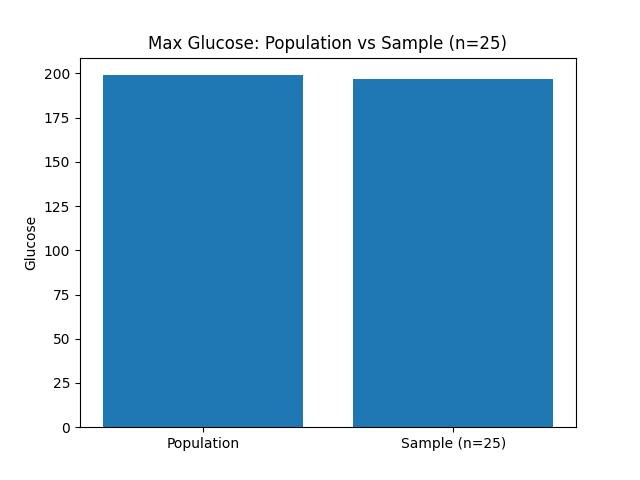
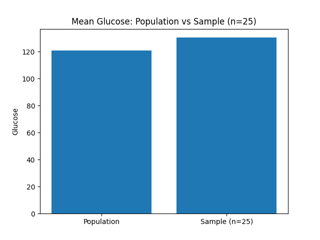

--------------------------------
Chart 1: Mean Glucose comparison
--------------------------------
Here is the chart 1: Mean Glucose comparison

--------------------------------
--------------------------------
Chart 2: Max Glucose comparison
--------------------------------
Here is the chart 2: Max Glucose comparison

--------------------------------
--------------------------------
Chart 1: Mean Glucose comparison
--------------------------------
Here is the chart 1: Mean Glucose comparison

The first figure compares the mean Glucose level of the full population with the mean from a random sample of 25 observations. The sample mean is expected to be close to the population mean, but slight differences occur due to sampling variability. Since the sample contains only a small portion of the population, its average depends heavily on which individuals happened to be selected. This illustrates how small samples can reasonably estimate central tendency but still fluctuate around the true value. The second figure compares the maximum Glucose value in the population with the maximum value in the sample. Here, the difference is much larger. Because extreme values are rare, a small sample of 25 is unlikely to capture the highest Glucose measurement found in the population. This visual gap highlights a key concept: small samples are poor at representing population extremes, even though they may approximate the mean reasonably well.
--------------------------------
--------------------------------
Chart 2: Max Glucose comparison
--------------------------------
Here is the chart 2: Max Glucose comparison

From this figure, we observe that the maximum Glucose value in the population and in the sample of 25 patients are almost identical. This is unusual because small samples typically fail to capture extreme values that exist in the full population. In this case, however, the random sample happened to include a patient whose Glucose level was nearly as high as the overall maximum recorded across all 768 individuals. This suggests that the sample contains at least one extreme or near-extreme observation. Overall, the figure shows that even a small sample can occasionally approximate population extremes, but this should not be assumed in general since such matches occur mostly by chance rather than representativeness.
--------------------------------
