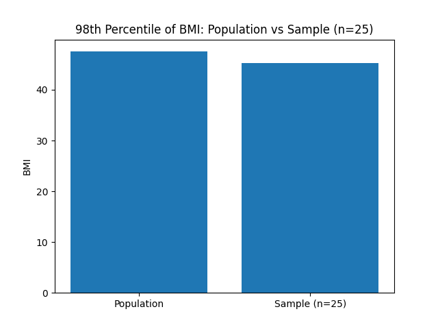
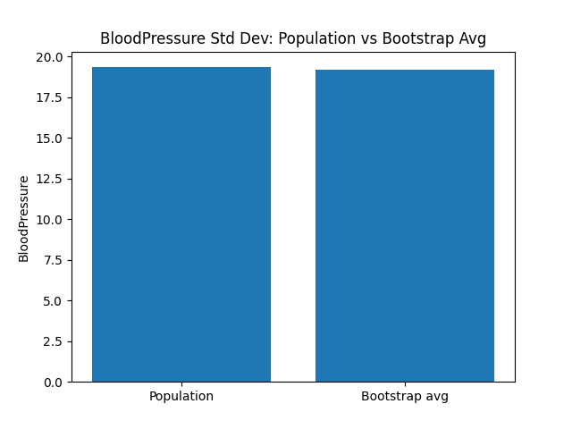
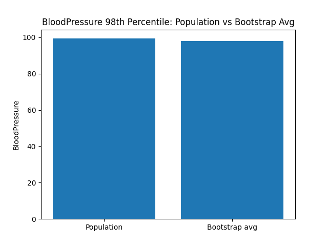
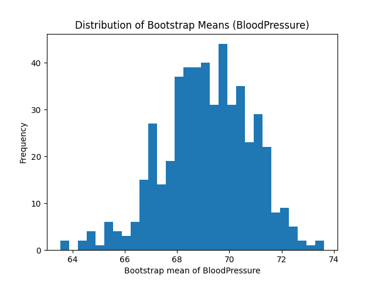

--------------------------------

Population Glucose mean: 120.89453125
Sample(25) Glucose mean: 130.36

Population Glucose max: 199
Sample(25) Glucose max: 197

--------------------------------
Chart 1: Mean Glucose comparison
--------------------------------
Here is the chart 1: Mean Glucose comparison

The first figure compares the mean Glucose level of the full population with the mean from a random sample of 25 observations. The sample mean is expected to be close to the population mean, but slight differences occur due to sampling variability. Since the sample contains only a small portion of the population, its average depends heavily on which individuals happened to be selected. This illustrates how small samples can reasonably estimate central tendency but still fluctuate around the true value. The second figure compares the maximum Glucose value in the population with the maximum value in the sample. Here, the difference is much larger. Because extreme values are rare, a small sample of 25 is unlikely to capture the highest Glucose measurement found in the population. This visual gap highlights a key concept: small samples are poor at representing population extremes, even though they may approximate the mean reasonably well.
--------------------------------
--------------------------------
Population Glucose max: 199
Sample(25) Glucose max: 197

--------------------------------
Chart 2: Max Glucose comparison
--------------------------------
Here is the chart 2: Max Glucose comparison

From this figure, we observe that the maximum Glucose value in the population and in the sample of 25 patients are almost identical. This is unusual because small samples typically fail to capture extreme values that exist in the full population. In this case, however, the random sample happened to include a patient whose Glucose level was nearly as high as the overall maximum recorded across all 768 individuals. This suggests that the sample contains at least one extreme or near-extreme observation. Overall, the figure shows that even a small sample can occasionally approximate population extremes, but this should not be assumed in general since such matches occur mostly by chance rather than representativeness.
--------------------------------
--------------------------------
Part (b)
--------------------------------
Population BMI 98th percentile: 47.52599999999996
Sample(25) BMI 98th percentile: 45.263999999999996
--------------------------------
--------------------------------
Chart 3: BMI 98th percentile comparison
--------------------------------
Here is the chart 3: BMI 98th percentile comparison

--------------------------------
This figure compares the 98th percentile of BMI for the full population with the 98th percentile from the sample of 25 observations. We observe that the two values are close but not identical. This difference is expected: the 98th percentile is a high-end, tail statistic, and tail values are extremely sensitive to sample size. Because the sample contains only 25 individuals, its upper-percentile estimate is based on very few data points, so even small changes in the selected observations can shift the percentile noticeably. The population’s 98th percentile is more stable because it uses all 768 observations. The chart shows that while the sample gives a rough approximation, small samples are less reliable for estimating extreme percentiles compared to central measures like the mean.
--------------------------------
--------------------------------
Part (c)
--------------------------------
Population BloodPressure mean: 69.10546875
Population BloodPressure std : 19.355807170644777
Population BloodPressure 98th percentile: 99.31999999999994
--------------------------------

--------------------------------
Part (c)
--------------------------------
Bootstrap average mean: 69.15222666666666
Bootstrap average std : 19.192792750902836
Bootstrap average 98th percentile: 98.03292000000003
--------------------------------
--------------------------------
Part (d)
--------------------------------
Population BloodPressure mean: 69.10546875
Bootstrap average mean: 69.15222666666666
Bootstrap average std : 19.192792750902836
Bootstrap average 98th percentile: 98.03292000000003
--------------------------------

Here is the chart D1: Mean comparison

Here is the chart D2: Std deviation comparison

Here is the chart D3: 98th percentile comparison

Here is the chart D4: Distribution of Bootstrap Means

--------------------------------
